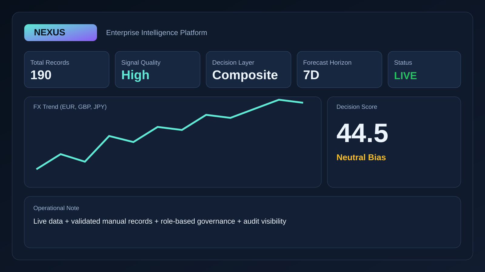
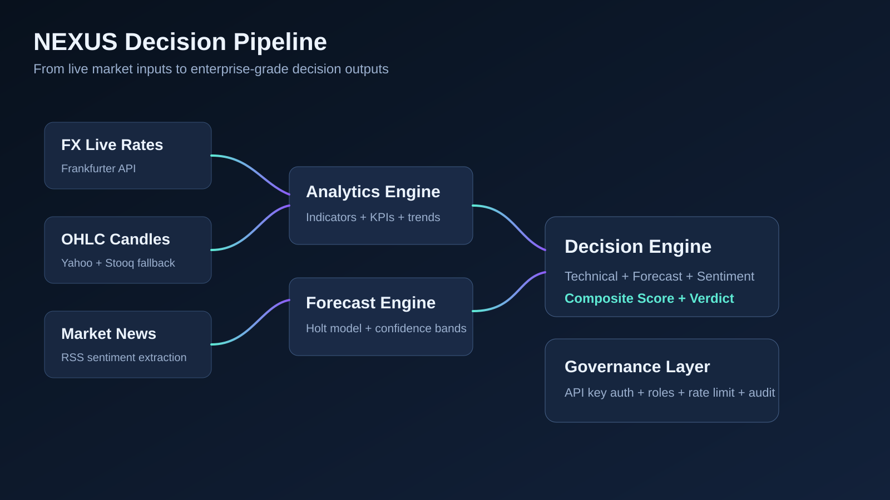
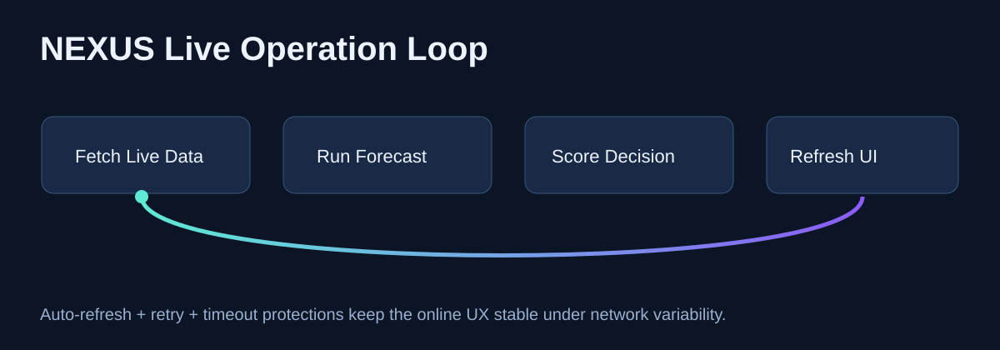

# NEXUS

Enterprise-grade FX intelligence platform with live analytics, technical signals, forecast modeling, sentiment context, and governance-ready operations.

## Live Endpoints

- GitHub Pages (presentation): https://rezakarimzadeh98.github.io/nexus/
- Live app (active tunnel): https://1f083b5b6204d7.lhr.life
- Local app: http://127.0.0.1:8080
- Repository: https://github.com/Rezakarimzadeh98/nexus

## Finalized Highlights

- Real-time analytics workflow with manual overrides
- Full technical indicator pipeline (20+ indicators)
- Forecasting with confidence bands and quality metrics
- Sentiment analysis with non-blocking fallback
- Composite decision scoring engine
- API key auth + role model + rate limits + audit events
- Online hardening: upstream timeout, retry, concurrency control, graceful fallback

## Demo Media (Images + GIF + Video)

### Images




### GIF



### Video

- Walkthrough link (open live environment): https://1f083b5b6204d7.lhr.life
- Product landing page with platform overview: https://rezakarimzadeh98.github.io/nexus/

## Quick Start

```bash
npm install
npm start
```

Open http://127.0.0.1:8080

## Stable Online Runbook

Start stable online mode with one command:

```bash
npm run online:start
```

Start resilient online mode (auto-reconnect when tunnel drops):

```bash
npm run online:resilient
```
Tunnel note: resilient mode now uses auto-fallback across `localhost.run`, `localtunnel`, and `serveo`.
If one provider disconnects or denies access, the script retries with another provider automatically.

Health checks:

```bash
npm run health:local
```

```bash
npm run health:live -- -Url https://1f083b5b6204d7.lhr.life/api/health
```

## API Surface

- GET /api/health
- GET /api/fx/timeseries?base=USD&targets=EUR,GBP,JPY&days=30
- GET /api/analytics/overview?base=USD&targets=EUR,GBP,JPY&days=180
- GET /api/forecast/overview?base=USD&targets=EUR,GBP,JPY&days=180&horizon=7
- GET /api/news/analyze?query=forex%20market&max=10
- GET /api/decision/score?base=USD&targets=EUR,GBP,JPY&days=180&horizon=7&newsQuery=forex%20market&newsMax=10
- GET /api/market/overview?market=all&days=30
- GET /api/market/forecast?market=crypto&days=30&horizon=7
- GET /api/market/decision?market=commodities&days=30&horizon=7&newsQuery=gold%20oil%20market&newsMax=10
- POST /api/manual-records
- GET /api/admin/me
- GET /api/admin/audit?limit=50

## Project Structure

```text
nexus/
  public/                  # Dashboard UI (HTML/CSS/JS)
  src/
    config/                # Constants and security config
    domain/                # Input validation
    infrastructure/        # External providers, stores, HTTP utility
    middleware/            # Auth, rate-limit, audit
    routes/                # API endpoints
    services/              # Analytics, indicators, forecast, decision, news
    app.js                 # Express composition
    server.js              # HTTP server runtime settings
  docs/media/              # Repository media assets
  scripts/                 # Online bootstrap and health checks
  README.md
```

## Architecture Notes

- `src/infrastructure/httpClient.js`: timeout + retry + controlled concurrency
- `src/routes/analyticsRoutes.js`: resilient `Promise.allSettled` handling
- `src/routes/decisionRoutes.js`: fallback behavior for optional providers
- `src/routes/forecastRoutes.js`: online-first fallback for manual-store issues
- `src/server.js`: request timeout hardening

## Security & Governance

- Role model: `viewer`, `analyst`, `admin`
- API key required for protected routes
- Per key/IP rate limiting
- Audit logging for operational observability

Default keys:

- nexus-viewer-2026
- nexus-analyst-2026
- nexus-admin-2026

## Operational Status

- Local health checks on `127.0.0.1`: stable
- Live tunnel checks on `localhost.run`: stable in repeated probes
- GitHub Pages deployment: automated by workflow on each push
