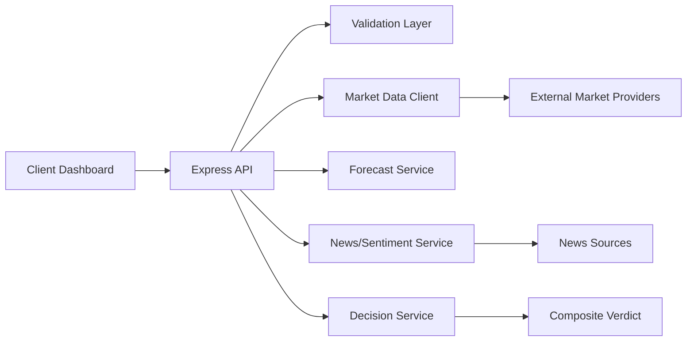

# NEXUS

NEXUS is a live multi-market analytics and decision intelligence platform for:

- Forex
- Stocks
- Crypto
- Commodities (gold, oil, etc.)

It combines technical indicators, quantitative signals, and fundamental/news context into explainable decision scoring.

## Live Demo

- Web app: https://rezakarimzadeh98.github.io/nexus/

Stable links (always valid):

- Dashboard: https://rezakarimzadeh98.github.io/nexus/
- Live launcher page: https://rezakarimzadeh98.github.io/nexus/live.html
- Repository: https://github.com/Rezakarimzadeh98/nexus

The live entry is designed to open directly and route users to the available runtime endpoint when needed.

## Why NEXUS

NEXUS focuses on three goals:

- Real data, not mock data.
- Visual analysis across major market classes.
- Transparent decision logic with explicit scoring components.

## Core Features

- Multi-market ingestion with configurable symbol lists.
- Historical OHLC series loading and normalization.
- Forecast bundles with trend context.
- News sentiment enrichment.
- Analysis lens modes:
  - `hybrid`
  - `technical`
  - `fundamental`
  - `quant`
- Explainable score decomposition:
  - technical score
  - quantitative score
  - fundamental score
  - composite score
  - verdict
- Professional dashboard:
  - overview cards
  - indicator table
  - forecast charting
  - decision panel with weights and quality metrics

## Data Coverage

Default market mappings include symbols from:

- Forex: EURUSD, GBPUSD, USDJPY, AUDUSD, USDCAD
- Stocks: AAPL, MSFT, GOOGL, AMZN, TSLA
- Crypto: BTCUSD, ETHUSD, BNBUSD, XRPUSD, SOLUSD
- Commodities: XAUUSD (gold), CL (oil), SI (silver), NG (natural gas), HG (copper)

You can also pass custom symbols in API queries.

## Architecture

High-level flow:



Backend structure:

- `src/routes`: HTTP endpoints
- `src/domain`: validation and domain contracts
- `src/services`: analytics/forecast/decision orchestration
- `src/infrastructure`: provider clients and resiliency adapters
- `public`: frontend assets

## Decision Modes

Decision payloads support an analysis mode (`analysisMode`) to adjust scoring weights:

- `hybrid`: balanced cross-signal mode
- `technical`: emphasizes indicator-derived market structure
- `fundamental`: emphasizes sentiment/news context
- `quant`: emphasizes statistical consistency and risk-adjusted behavior

Each response returns applied weights and component scores.

## Indicator Formula Reference

Below are the principal indicator definitions represented in NEXUS outputs.

### Moving Averages

- Simple Moving Average (SMA):
$$
SMA_n = \frac{1}{n}\sum_{i=0}^{n-1} P_{t-i}
$$

- Exponential Moving Average (EMA):
$$
EMA_t = \alpha P_t + (1-\alpha) EMA_{t-1}, \quad \alpha = \frac{2}{n+1}
$$

### Relative Strength Index (RSI)

$$
RSI = 100 - \frac{100}{1 + RS}, \quad RS = \frac{AvgGain_n}{AvgLoss_n}
$$

### MACD

$$
MACD = EMA_{12} - EMA_{26}
$$

Signal line:
$$
Signal = EMA_9(MACD)
$$

### Bollinger Bands

Middle band:
$$
MB = SMA_n
$$

Upper and lower bands:
$$
UB = MB + k\sigma_n, \quad LB = MB - k\sigma_n
$$

### ATR (Average True Range)

True range:
$$
TR_t = \max(H_t - L_t, |H_t - C_{t-1}|, |L_t - C_{t-1}|)
$$

Average:
$$
ATR_n = \text{MovingAverage}(TR, n)
$$

### ADX (Average Directional Index)

Directional movement and smoothed directional indicators are used to compute trend strength:

$$
ADX = \text{MA}\left(\frac{|DI^+ - DI^-|}{DI^+ + DI^-} \times 100, n\right)
$$

### CCI (Commodity Channel Index)

Typical price:
$$
TP = \frac{H+L+C}{3}
$$

Index:
$$
CCI = \frac{TP - SMA(TP,n)}{0.015 \times MD}
$$
where $MD$ is mean deviation.

### Stochastic Oscillator

$$
\%K = 100 \times \frac{C - LL_n}{HH_n - LL_n}
$$

### ROC (Rate of Change)

$$
ROC_n = \frac{P_t - P_{t-n}}{P_{t-n}} \times 100
$$

### Momentum

$$
Momentum_n = P_t - P_{t-n}
$$

### Z-Score

$$
Z = \frac{P_t - \mu_n}{\sigma_n}
$$

## Composite Scoring Logic

NEXUS combines multiple dimensions into a final score:

$$
S_{composite} = w_t S_{technical} + w_q S_{quant} + w_f S_{fundamental}
$$

Where:

- $w_t + w_q + w_f = 1$
- weights are mode-dependent (`hybrid`, `technical`, `fundamental`, `quant`)

Supporting quality controls include:

- forecast quality score
- risk-adjusted score

Verdict thresholds map the composite output to categories like bullish/neutral/bearish.

## API Reference

### Health

- `GET /api/health`

Example:

```bash
curl http://127.0.0.1:8080/api/health
```

### Market Overview

- `GET /api/market/overview?market=all&symbols=&days=365`

Returns normalized market snapshots and computed indicator-ready statistics.

### Market Forecast

- `GET /api/market/forecast?market=forex&symbols=EURUSD,GBPUSD&days=365&horizon=14`

Returns forecast items and prediction method metadata.

### Market Decision

- `GET /api/market/decision?market=all&symbols=&days=365&horizon=14&analysisMode=hybrid&newsQuery=forex%20market&newsMax=20`

Returns:

- mode
- applied weights
- technical/quant/fundamental component scores
- composite score
- verdict
- forecast and sentiment context

## UI Explainability

The dashboard explains:

- what data was analyzed
- which indicators influenced scoring
- mode-specific weight allocations
- quality/risk context behind the decision

This is meant for analytical support, not guaranteed financial outcomes.

## Accuracy, Limits, and Risk Notice

- Market data and news feeds may contain delays or outages.
- Model outputs are probabilistic and regime-dependent.
- Scores are decision-support signals, not investment advice.
- Always validate with independent analysis and risk controls.

## Enterprise Readiness Elements

- API key protection on protected endpoints
- Role-based admin checks where required
- Rate limiting middleware
- Structured audit logging
- Retry + timeout patterns for upstream calls

## Local Development

Requirements:

- Node.js 18+

Install and run:

```bash
npm install
npm start
```

Final verification:

```bash
npm run verify:final
```

Open:

- http://127.0.0.1:8080

## Online Runtime Notes

GitHub Pages is stable for frontend hosting, but backend runtime must be provided.
No hardcoded runtime URL is bundled in the public app.

Recommended usage flow:

1. Open dashboard: https://rezakarimzadeh98.github.io/nexus/
2. In "Online Runtime Connection", enter your active backend runtime URL.
3. Click "Connect Runtime".
4. Dashboard saves runtime locally and reuses it in next sessions.

If you use tunnel providers:

- tunnels are ephemeral and may expire anytime
- generate a fresh tunnel and reconnect runtime URL in dashboard

Runtime and architecture behavior:

- frontend is served from GitHub Pages
- backend is called via runtime base URL from dashboard settings
- CORS is enabled for GitHub Pages origin with x-api-key header
- localhost helper auto-detects active ports 8080-8085
- auto refresh supports second-level intervals for fast monitoring

## Repository Media

Visual assets:

- `docs/media/nexus-dashboard.svg`
- `docs/media/nexus-flow.svg`
- `docs/media/nexus-live-loop.svg`

You can also add GIF captures to document user flows and release highlights.

## Contribution Guide

- See `CONTRIBUTING.md`
- Be respectful: `CODE_OF_CONDUCT.md`
- Security process: `SECURITY.md`

## Labels and Triage Taxonomy

Suggested labels are defined in:

- `.github/labels.yml`

Suggested auto-label mapping by file changes:

- `.github/labeler.yml`

Recommended core labels:

- `bug`
- `enhancement`
- `needs-triage`
- `good first issue`
- `help wanted`
- `documentation`
- `frontend`
- `backend`
- `ops`

## Viral Growth and Community Loop

To make the project easy to discover and adopt:

- Keep release notes short and visual.
- Publish before/after GIFs for major features.
- Tag issues with `good first issue` for newcomers.
- Keep contribution docs and templates strict but simple.
- Add practical examples and API snippets in README.

## Governance Starter Pack (Included)

- Pull request template: `.github/pull_request_template.md`
- Bug and feature issue templates: `.github/ISSUE_TEMPLATE/`
- Conduct, security, contributing docs in repo root

## Roadmap

See `ROADMAP.md` for near/mid/long-term priorities.

## License

Add your preferred OSS license (MIT/Apache-2.0/etc.) if not already present.
