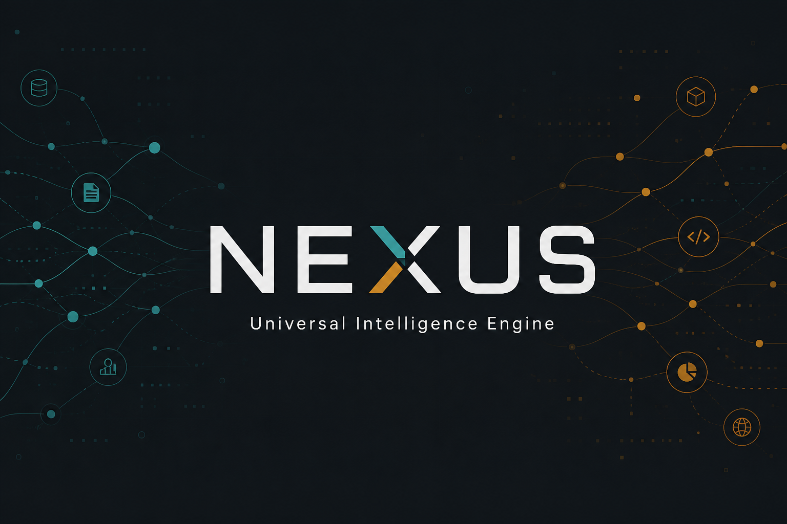
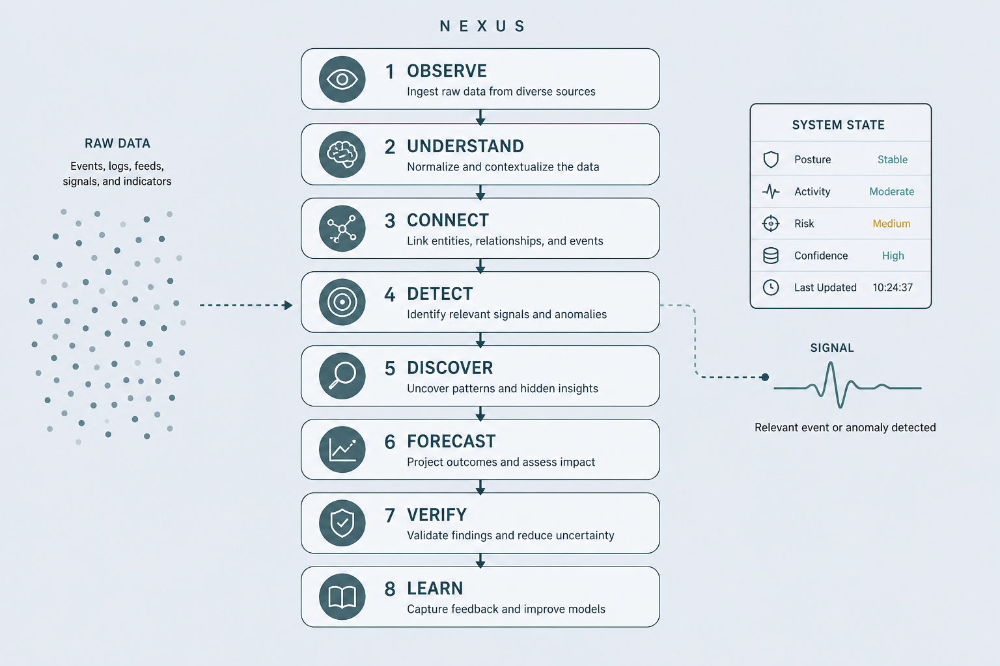
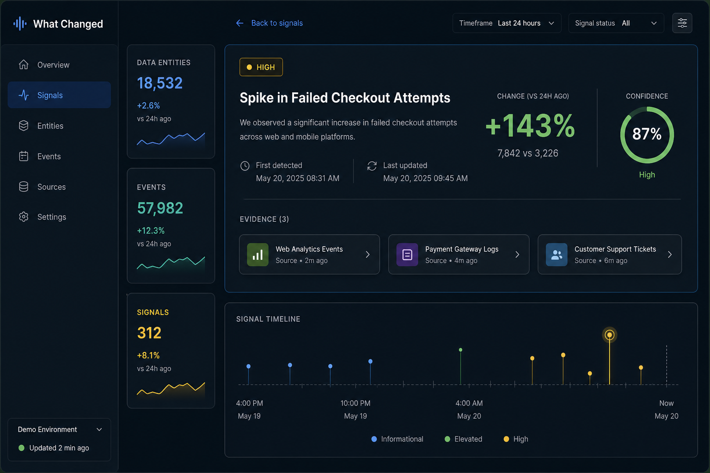

# NEXUS

**Universal Intelligence Engine**

Turn scattered, high-volume data into a living model of reality: what is happening now, what just changed, what it connects to, what may happen next — and whether those claims hold up against the truth.

[Product](docs/PRODUCT.md) · [Roadmap](docs/ROADMAP.md) · [Architecture](docs/ARCHITECTURE.md) · [Share kit](docs/SHARE.md) · [Contributing](CONTRIBUTING.md)

---

## The problem people feel

There is too much data and not enough understanding.

Sources disagree. Timelines drift. Dashboards count events but cannot say *what changed in the system*. Chat-style tools answer a prompt and forget state, provenance, and scorekeeping.

**NEXUS is built for a different job:** keep a living model, detect meaningful change, show the evidence, forecast with probability — then measure whether you were right.

---

## What NEXUS does

`	ext
10,000,000 data points
        ↓
   entities · events · relations
        ↓
     living current state
        ↓
   signals · patterns · forecasts
        ↓
   evidence · outcomes · evaluation
`

| Capability | Plain meaning |
| --- | --- |
| **Observe** | Pull heterogeneous sources continuously |
| **Understand** | Normalize time, language, duplicates |
| **Connect** | Entities, events, relationships |
| **Detect** | State shifts, signals, anomalies with explanations |
| **Discover** | Recurring patterns from history |
| **Forecast** | Probabilistic scenarios — never false certainty |
| **Verify** | Compare predictions to what actually happened |
| **Learn** | Feed errors back into thresholds and models |

---

## Not another "ask the model" stack

`	ext
Wrong shape                         NEXUS shape
───────────                         ───────────
Data → LLM → Answer                 Data → structured intelligence
                                    → state → signals → patterns
                                    → forecast → outcome → evaluation
`

Large language models may help with extraction, classification, and explanation.
They are **not** the product. Forecasting and anomaly detection ship with measurable baselines first.

---

## Domain-agnostic core

The engine only knows public concepts:

Entity · Event · Observation · Relationship · State · Signal · Pattern · Forecast · Evidence · Outcome

Adapters plug domains on top — news, finance, cyber, supply chain, open analytical research — without rewriting the core.

---

## What you will see (target experience)

A visitor should open the demo and immediately see:

- live counters (data, entities, events, signals)
- a **What Changed?** feed
- one click into **evidence**, timeline, related entities, and forecast context

Live dashboard ships in **Phase 6**. Until then this preview is the product north star.

---

## Quick start (Phase 1 foundation)

Requirements: Python 3.11+, Docker Compose (for Postgres).

`ash
cp .env.example .env
docker compose -f infrastructure/compose.yml up -d
python -m pip install -e ".[dev]"
alembic upgrade head
pytest -q
nexus
`

---

## Proof question

> Can heterogeneous public data become a living model that detects important change earlier than naive counting, explains it with source-linked evidence, and produces forecasts we can score against reality?

If benchmarks say yes, NEXUS is more than a demo — it is a platform.

---

## Roadmap at a glance

| Phase | Name | You get |
| ---: | --- | --- |
| 0 | Lock and bootstrap | Product, architecture, public repo |
| **1** | **Foundation** | Compose, CI, schemas, core types |
| 2–3 | Observe and understand | Ingest + normalize (5–10 public sources) |
| 4–5 | Connect and detect | Entities/events + **state / signal / anomaly** + API |
| 6 | Show | Dashboard v0.1 — What Changed + evidence |
| 7–8 | Discover and forecast | Graph, patterns, scenarios, probabilities |
| 9–10 | Verify and learn | Replay, Brier/lead-time, feedback loops |
| 11 | Platform (v1.0) | Adapters, SDK, API, web platform |
| 12 | Enterprise | Multi-tenant, SSO, SLA, scale, governance |

Every checkbox lives in [docs/ROADMAP.md](docs/ROADMAP.md). The roadmap is updated as phases complete.

---

## Repository layout

`	ext
nexus/
├── src/nexus_core/   # package: types, config, db
├── core/             # engines (filled in later phases)
├── adapters/
├── api/
├── dashboard/
├── alembic/          # migrations
├── infrastructure/   # Compose
├── docs/
└── tests/
`

---

## Status (honest)

**Phase 1 (Foundation) is complete. Phase 2 (Ingestion) is next.**

NEXUS is not yet a production intelligence cloud. Stars help; reproducible pipelines and public benchmarks matter more.

---

## Non-goals

- Operational military targeting or action guidance
- Treating "prompt → answer" as the whole product
- Declaring the future as certain

---

## Get involved

- Read the [product lock](docs/PRODUCT.md) and [roadmap](docs/ROADMAP.md)
- Open a [Discussion](https://github.com/Rezakarimzadeh98/nexus/discussions) with a domain or data problem
- Take a roadmap checkbox and open a focused PR ([Contributing](CONTRIBUTING.md))

Launch copy: [docs/SHARE.md](docs/SHARE.md)

## License

MIT © [Reza Karimzadeh](https://github.com/Rezakarimzadeh98)
